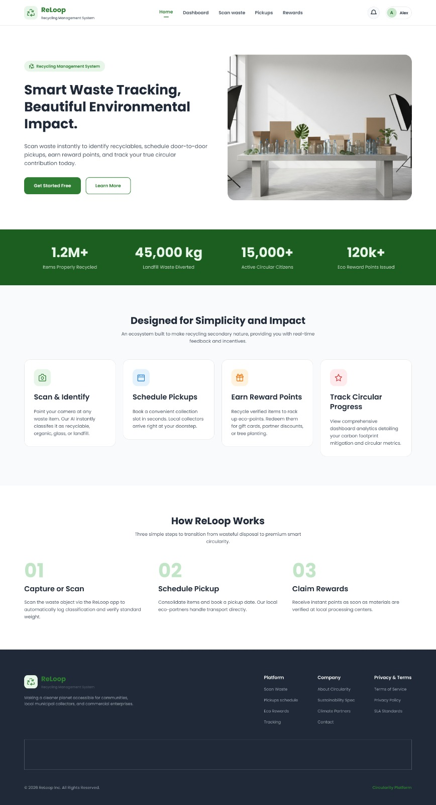
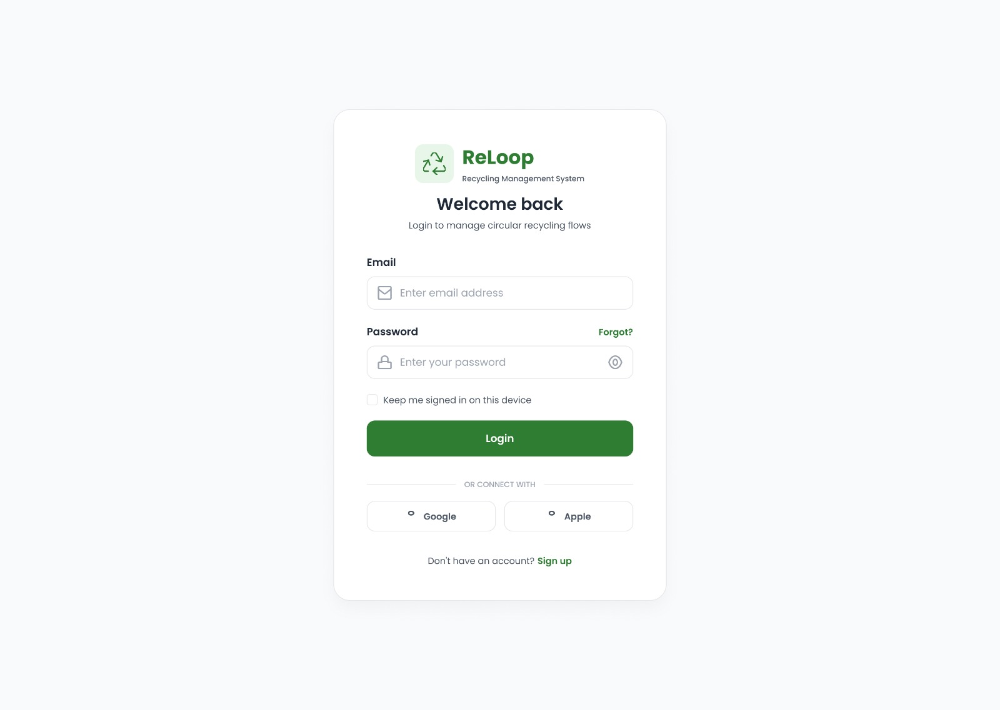
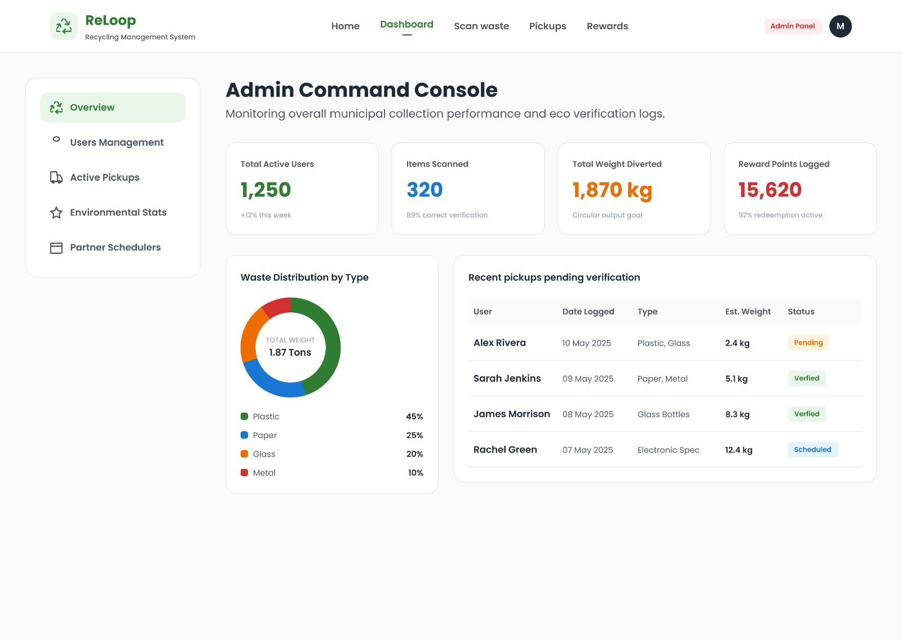
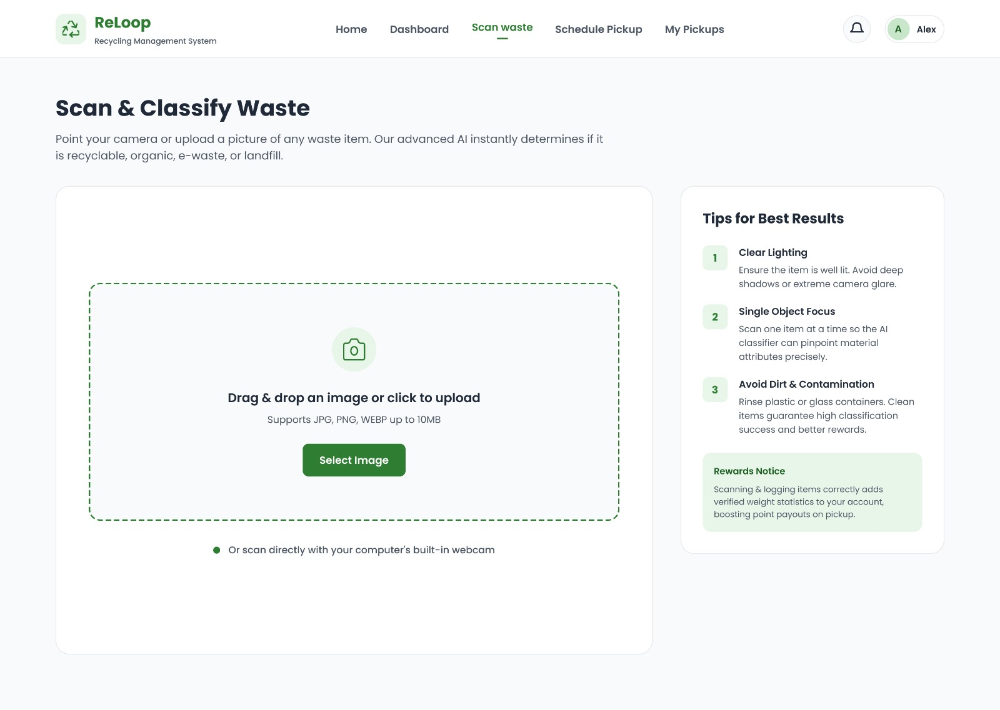
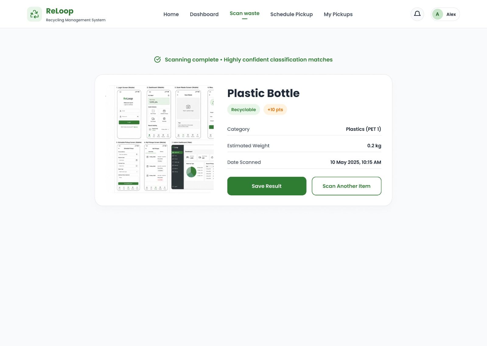
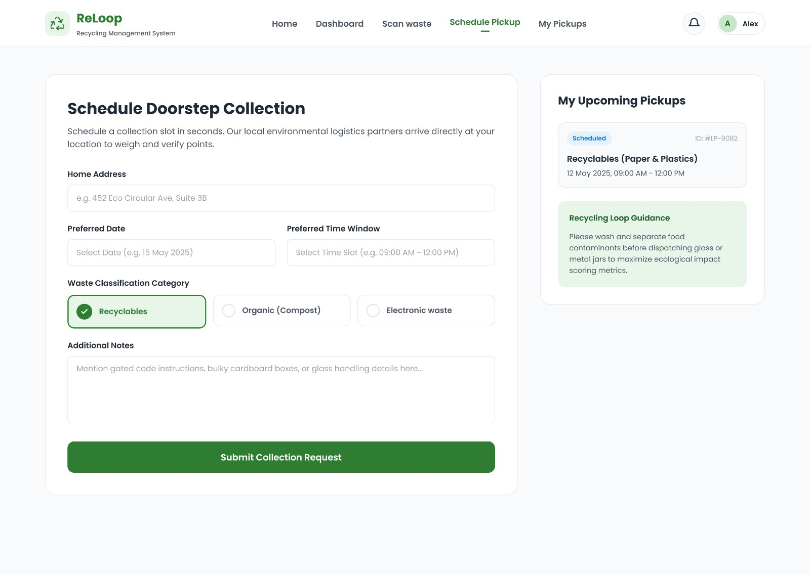
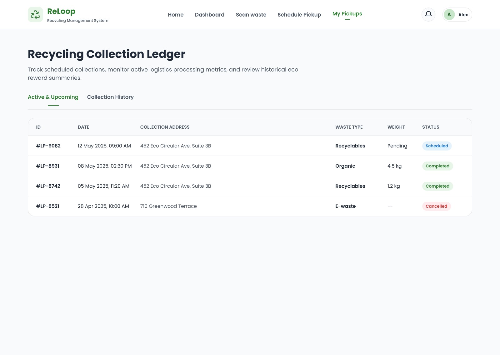

# ReLoop Technologies Web App

ReLoop is a recycling management web application built with ASP.NET Core Razor Pages. It supports user authentication screens, waste scan classification, pickup scheduling, pickup history, rewards summaries, admin monitoring, and SQL-backed persistence.

## Features

- Landing page based on the ReLoop visual design.
- Login and sign-up pages with client-side and API validation.
- User dashboard with impact metrics, activity, quick actions, and upcoming pickups.
- Waste scan upload flow with classification result details.
- Doorstep pickup scheduling form with category selection and validation.
- Pickup ledger with status filtering.
- Admin command console with KPIs, waste distribution, and verification rows.
- REST API endpoints for auth, dashboard, scan classification, pickups, admin stats, and rewards.
- Entity Framework Core SQL Server/Azure SQL persistence with migrations and seed data.
- xUnit integration tests and GitHub Actions CI workflow.

## Tech Stack

- ASP.NET Core Razor Pages
- .NET 8
- Entity Framework Core 8
- SQL Server / Azure SQL
- Bootstrap static assets
- xUnit, ASP.NET Core TestHost, EF Core InMemory for tests

## Branches

- `issue-1-ui-design-system`: global UI design system foundation.
- `issue-2-landing-page`: ReLoop landing/home page.
- `issue-3-9`: authentication, dashboard, scan, pickup, admin, and API work.
- `issue-10-azure-sql-ef-core`: EF Core SQL Server/Azure SQL persistence.
- `issue-11-e2e-testing-qa`: automated tests, QA checklist, and CI workflow.

## Run Locally

```powershell
dotnet restore
dotnet run
```

The project launch settings use:

```text
http://localhost:5197
https://localhost:7036
```

If that port is already being used, run:

```powershell
dotnet run --urls http://localhost:5299
```

## SQL Connection String

For local development, place your SQL Server or Azure SQL connection string in:

```text
appsettings.Development.json
```

Use this key:

```json
"ConnectionStrings": {
  "ReLoopDatabase": "Server=tcp:<your-server>.database.windows.net,1433;Initial Catalog=<your-database>;Persist Security Info=False;User ID=<your-user>;Password=<your-password>;MultipleActiveResultSets=False;Encrypt=True;TrustServerCertificate=False;Connection Timeout=30;"
}
```

For production hosting, set this environment variable or app setting instead of committing secrets:

```text
ConnectionStrings__ReLoopDatabase
```

More details are in [SQL-CONNECTION-SETUP.md](SQL-CONNECTION-SETUP.md).

## Database Setup

Install or restore the local EF tool:

```powershell
dotnet tool restore
```

Apply the migration:

```powershell
dotnet tool run dotnet-ef database update
```

The migration creates tables for users, pickups, scan records, activity logs, and reward ledger entries.

## Testing

Run all tests:

```powershell
dotnet test
```

The test project uses an in-memory database so CI and local testing do not require a live Azure SQL database.

The manual QA checklist is in [QA-CHECKLIST.md](QA-CHECKLIST.md).

## Wireframes

The images below are the supplied wireframes and brand references used for the implementation.

### Landing Page



### Login Page



### Admin Dashboard



### Scan Upload Page



### Scan Result Page



### Schedule Pickup Page



### Pickup Ledger Page



### App Logo


### Brand Logo


## Notes

- Demo auth currently validates input and creates or finds users through the app service, but it does not yet implement production password hashing or secure sessions.
- Scan classification is a deterministic demo classifier based on filename hints until an AI/image model is connected.
- Do not commit real Azure SQL credentials.
